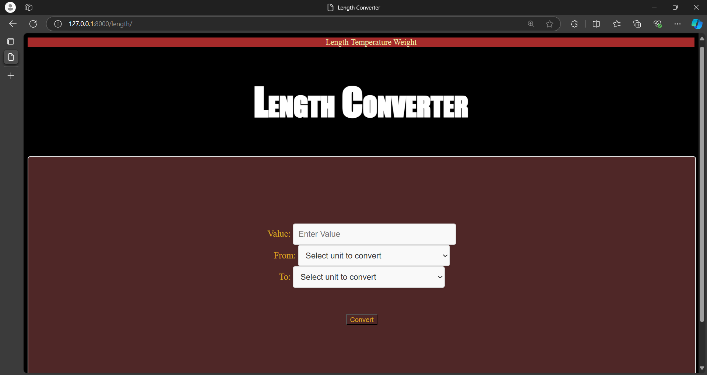

# Unit Convertor
I have a sample of unit convertor with some simple logics in django
# Implemented Things
I have imple mented some of the convertion to make it much easier to understand
# Interface

This is thev sample Inter face of the page
# Project Explanation
In this project is totally based on **'Django a Python Framework'**.
# Profiles links
Linkedin www.linkedin.com/in/vasan-s-624b34253

Leetcode @VasanS2004

if you have any queries contact me vasansoundararajan.21@gmail.com

# Project Url
https://roadmap.sh/projects/unit-converter
